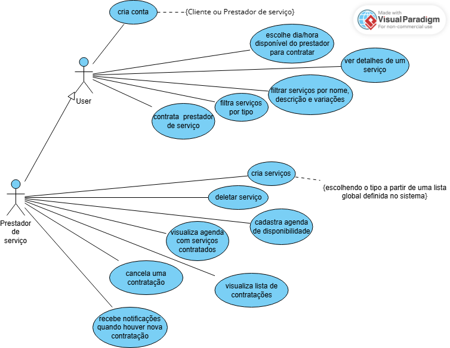

# 📋 Projeto sistema de marketplace de serviços de profissionais liberais

Aplicação fullstack para cadastro de prestadores, contratação de serviços e gerenciamento de agenda.  
Frontend em **SvelteKit**, backend em **Node.js (Fastify)**, banco **Postgres**, cache **Redis** e busca com **Elasticsearch**.  
Tudo containerizado via **Docker Compose**.

## 🚀 Como rodar o projeto com Docker

Baixe esse repositório em sua máquina, usando:

```sh
git clone https://github.com/Romeusorionaet/Mini-Marketplace.git
```

Então entre na pasta Mini-Marketplace:

```sh
cd Mini-Marketplace
```

⚙️ Variáveis de Ambiente na pasta "mm-node-api":
Crie um arquivo (<strong>.env.production</strong>) na raiz, o arquivo .env.example possui valores corretos para ambiente docker-compose:

<a href="https://github.com/Romeusorionaet/Mini-Marketplace/blob/main/mm-api-node/.env.example" target="_blank">.env.example</a>

⚙️ Variáveis de Ambiente na pasta "mm-front-evelte":
Crie um arquivo (<strong>.env</strong>) na raiz, o arquivo .env.example possui valores corretos para local dev ou docker-compose:

<a href="https://github.com/Romeusorionaet/Mini-Marketplace/blob/main/mm-front-svelte/.env.example" target="_blank">.env.example</a>

---

1. **Subir containers (build inicial):**

```sh
docker-compose up --build
```

Espere pelo log:

> mini_marketplace_api | Server is running on port: 3333
> </br>
> mini_marketplace_api | ✅ Redis conectado

Agora para Popular o banco de dados abra um novo terminal mas não esqueça que acessar o mesmo diretório:

```sh
cd Mini-Marketplace
```

Rodar seed manualmente:

```sh
docker-compose exec api npm run seed
```

#### Para visualizar o Mini Marketplace no navegador acesse: "http://localhost:3000"

Agora você pode visualizar o Mini Marketplace!

> Voce pode se registrar como cliente e testar a aplicação, se o seed foi executado você poderá ver tipos de serviços procurar por algum e clicar para visualizar a agenda de disponibilidade do prestador de serviço e reservar um horário.

> Como prestador de serviço você pode logar com email "ana@gmail.com" ou "carlos@gmail.com" com a senha "123456" caso o seed ter sido execultado esses serão as contas registradas como prestadores de serviço.

---

Parar os containers (sem perder os dados):

```sh
docker-compose down
```

Subir novamente (dados persistem nos volumes):

```sh
docker-compose up -d
```

## ✅ Escopo Mínimo Implementado (O que foi feito)

### 1) Cadastro de Prestador

- Criar conta de prestador (registro/login/logout) ✅
- Área administrativa (painel prestador) ✅
- Criar serviços com variações (nome, preço, duração, descrição, fotos, tipo global) ✅
- Agenda de disponibilidades (dias/horários) ✅

### 2) Cliente (Website principal)

- Navegar sem login ✅
- Cadastro de cliente ✅
- Filtrar serviços por tipo ✅
- Ver detalhes de um serviço (quem oferece, descrição, variações) ✅
- Contratar escolhendo variação + data/hora ✅

### 3) Contratação

- Reservar slot de data/hora + duração ✅
- Evitar sobreposição de horários ✅
- Compra automaticamente aprovada ✅

### 4) Painel do Prestador

- Visualizar agenda de serviços contratados ✅
- Lista de contratações ✅
- Cancelamento de contratação ✅
- Notificação simples ao receber contratação ✅

---

## 🌟 Extras (Explorados Parcialmente)

- Integração com Redis para cache ✅
- Elasticsearch para busca avançada de serviços ✅

---

## 🛠 Stack Técnica

- **Backend:** Node.js (Fastify)
- **Frontend:** SvelteKit
- **Banco de dados:** Postgres
- **Cache:** Redis
- **Busca:** Elasticsearch
- **Infra:** Docker + Docker Compose

---

## 🔹 Diagrama de Caso de Uso

Este diagrama mostra como **usuários (clientes e prestadores de serviço)** interagem com o sistema, incluindo cadastro, contratação, criação de serviços e gerenciamento da agenda.



## 🔹 Modelagem de Dados

A modelagem foi feita com **dbdiagram.io**, representando as principais entidades do sistema e seus relacionamentos.


---

# Estrutura de Rotas do Frontend (SvelteKit)

> Esta é a estrutura principal do frontend construído com SvelteKit, mostrando as rotas, páginas, layouts e scripts de carregamento (Page Load) utilizados na aplicação.  
> A organização segue a lógica de **cliente, prestador (provider-panel) e autenticação**.

```
src/routes
├─ auth/                        # Autenticação
│  ├─ sign-in/+page.svelte      # Tela de login
│  └─ sign-up/+page.svelte      # Tela de cadastro
├─ client/my-hirings/+page.svelte  # Contratações do cliente
├─ provider-panel/              # Painel do prestador
│  ├─ hirings/+page.svelte      # Novas contratações
│  ├─ history-services/         # Histórico de serviços do prestador
│  │  ├─ +page.svelte
│  │  └─ +page.ts               # Page Load Script
│  ├─ schedule/                 # Agenda do prestador
│  │  ├─ +page.svelte
│  │  └─ +page.ts               # Page Load Script
│  ├─ +layout.svelte            # Layout do provider-panel
│  ├─ +page.svelte              # Dashboard do prestador
│  └─ +page.ts                  # Page Load Script do dashboard
├─ service-details/[id]/+page.svelte  # Página de detalhes de serviço
├─ +layout.svelte               # Layout geral do site
└─ +page.svelte                 # Homepage
```

> > Observação: arquivos `+page.ts` são Page Load Scripts do SvelteKit que carregam dados do backend antes da renderização da página correspondente.

---

👨‍💻 Autor

Desenvolvido por Romeu soares – Desenvolvedor Web
<a href="https://www.linkedin.com/in/romeu-soares-87749a231/" target="_blank">🔗 LinkedIn</a>
